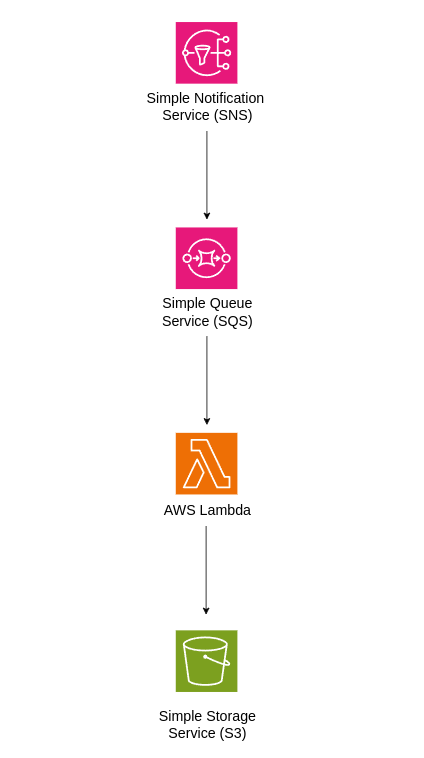

<h1 align = center > AWS infras as Terraform code </h1>

<p align="center">


</p>

Esse repositório declara o código fonte para provisionar o Datacenter AWS da infraestrutura do sistema da [API de categorias e produtos](https://github.com/Mr-Sena?tab=repositories).


## Reference Links: 

 - Producer Api: [catalog-product-api](https://github.com/Mr-Sena/catalog-product-api)
 - Serverless Consumer Repository: [Consumer-Lambda-Catalog](https://github.com/Mr-Sena/Consumer-Lambda-Catalog) - The same origin of the [*index.mjs*](./index.mjs) file.

<br>

## Diagrama de Arquitetura:

<p align="center">

</p>

<br>

## Procedimentos para provisionar o datacenter: 
 
 Acessar a conta do usuário AWS:
``` 
 aws login
``` 
<br>

 Executar o provisionamento: 
``` 
 terrafrom apply